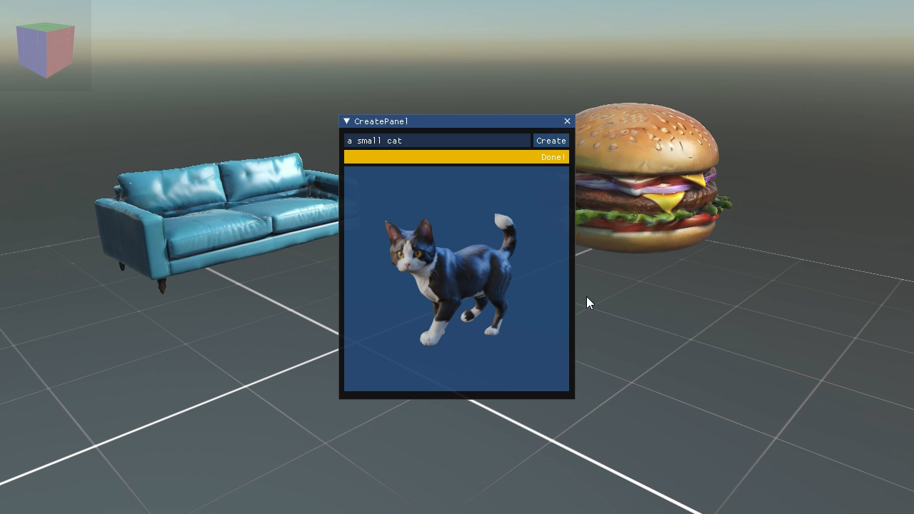
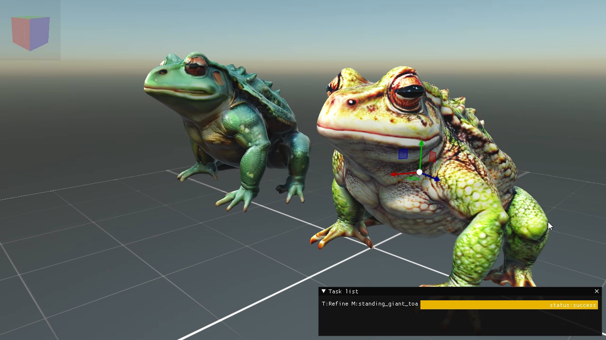

# Donatello AI

[TripoAI](https://www.tripo3d.ai) offers a cutting-edge [API-Rest](https://platform.tripo3d.ai/docs/introduction) that seamlessly integrates AI-generated models into your applications or tools. With its initial version released just last March, we're witnessing just the beginning of its potential.

I've developed a desktop tool leveraging TripoAI's service alongside [Evergine](https://evergine.com/) to put the platform through its paces. This tool allows users to input prompts and instantly generate multiple 3D models complete with textures and materials. It's a game-changer for those in need of free 3D models to prototype their scene creations.

## How to use

- Download the last [release](https://github.com/Jorgemagic/DonatelloAI/releases/latest)
- Generate an API key on the tripoAI platform [here](https://platform.tripo3d.ai/api-keys)
- Run the __DonatelloAI.windows.exe__ file.
- Set the API key in DonatelloAI by navigating to _File->Settings->Set Tripo API key_
- Start creating your 3D models by inputting your first prompt.