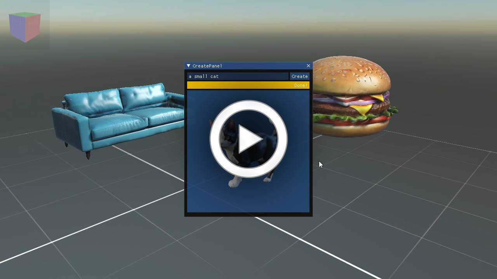
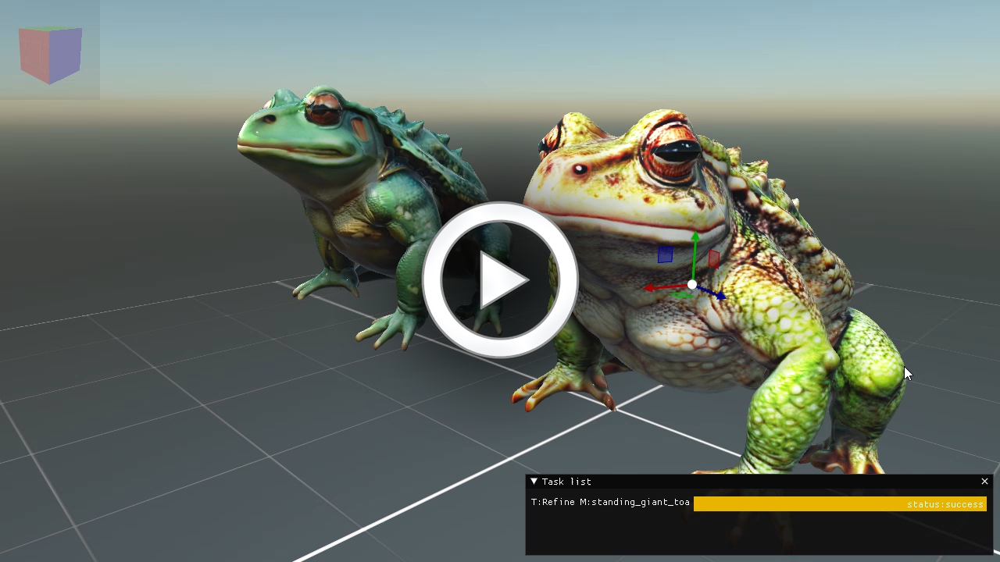

# Donatello AI

"Imagine being able to type anything and generate a 3D model within seconds."

_DonatelloAI_ name not only pays homage to the famous Italian sculptor Donatello but also reflects its integration with artificial intelligence, symbolizing a fusion of traditional craftsmanship and modern technology

I've developed a desktop tool leveraging __[TripoAI's service](https://platform.tripo3d.ai/docs/introduction)__ alongside __[Evergine](https://evergine.com/)__ to put the platform through its paces. This tool allows users to input prompts and instantly generate multiple 3D models complete with textures and materials.

## Features

- Text to 3D
- Image or Sketch to 3D
- AutoRig and animating generated models
- Stylization
- Optimized models and export to multiple formats GLTF, USDZ, FBX, OBJ, STL.
- Model Gallery
- Compose large scenes with generated models

## How to use

- Download the last [release](https://github.com/Jorgemagic/DonatelloAI/releases/latest)
- Generate an API key on the tripoAI platform [here](https://platform.tripo3d.ai/api-keys)
- Run the __DonatelloAI.windows.exe__ file.
- Set the API key in DonatelloAI by navigating to _File->Settings->Set Tripo API key_
- Start creating your 3D models by inputting your first prompt.

## More videos

### Generate draft models within seconds

### Refine textures

### Generate models from image or sketch

### Process models with multiples stylizations

### Auto-rig generated models and animate them

